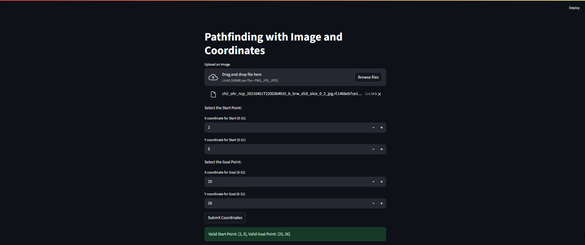

# Welcome to the Rover pathfinding project.

To get started setup a python virtual environment using -> `venv .env` in the console.

Install python dependencies by running -> `pip install -r requirements.txt`.

Run the api server using -> `python api.py` and then run the streamlit app by running -> `python -m streamlit run stapp.py`.

- Image upload -> crater-boulder detection -> binary obstacle map creation -> erosion operation of binary map -> pathfinding using [Neural A*](https://omron-sinicx.github.io/neural-astar/)  -> Path overlay vizualization.

Why Neural A*?

Traditional algorithms like djisktra or A*, are not meant for finding shortest paths in sparse obstacle map. Any-angle pathfinding algorithms like theta* was explored, but was very slow. Neural A* was both fast and fit for finding shortest path in such a scenario.

The algorithm is depicted as below:

Below are few screenshots of the app. 

